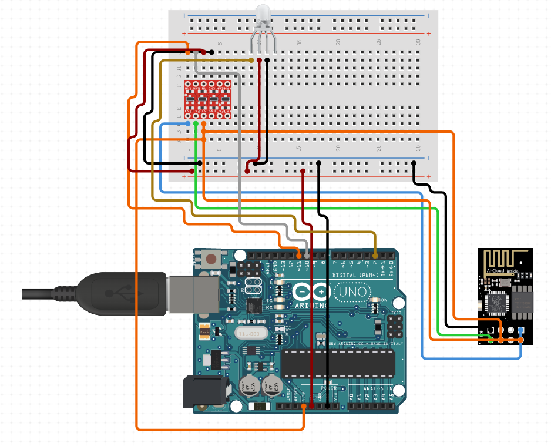
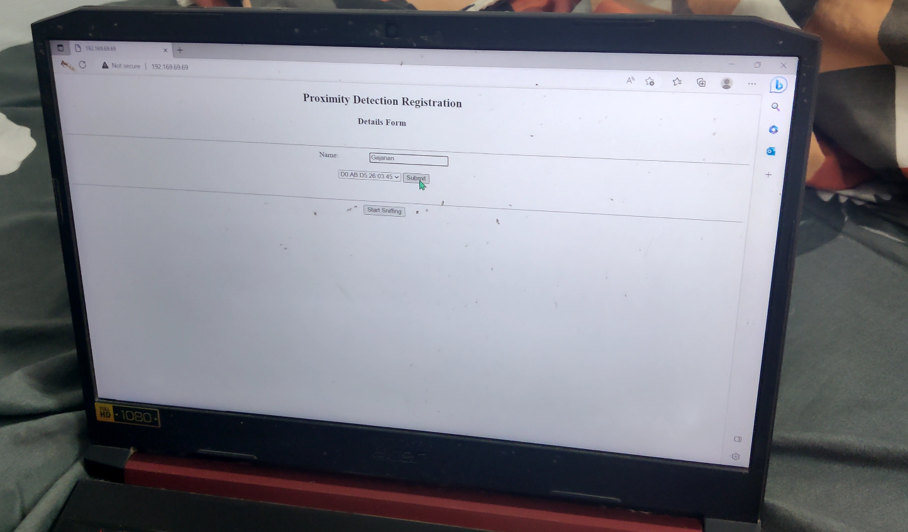
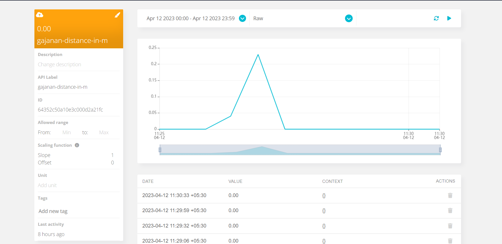

# Proximity Detection using Wireless Fidelity

This project requires: 
 1. Softwares & Accounts
    - Ubidots Account
    - Arduino IDE
 2. Physical requirements
    - NodeMCU 1.0
    - ESP8266 WiFi module
    - 4 pin RGB LED 
    - Connector wires 

Libraries Used: 
 1. ESPPL library: Ricardo Oliveria
 2. Non-OS SDK for ESP8266 : Espressif Systems

Kindly follow the given schematic diagram to make your circuitry:


## Steps to set up dev environment:
1. Download Arduino IDE.

2. Change the Preferences of the IDE, by adding the following in the Additional Board Managers URLs field:
```
http://arduino.esp8266.com/versions/2.3.0/package_esp8266com_index.json,http://arduino.esp8266.com/stable/package_esp8266com_index.json,http://phpsecu.re/esp8266/package_deauther_index.json
```

3.  Install the ESP8266 board library by 'ESP8266 Community' in from the Boards Manager. Install or download the ubidot's standalone helper library for ESP8266 boards.
``` 
URL: https://github.com/ubidots/ubidots-esp8266.git 
```


4. Clone this repository:
``` 
git clone www.github.com/gajanangitte/ProxDetector.git 
``` 

5. Connect your micro-controller to your computer and select the board and port in the Arduino IDE.

6. Open the Serial monitor and set the appropriate baud rate. (In our case: 115200)

7. Open an Educational Ubidots account. Generate an Ubidots Token.

8. Set the ubidots token in ```ubidots_manager.h``` file. 

9. Update the WiFi SSID and Password that you'll use to send data over the internet in the ```ubidots_manager.h``` file. 

7. You are ready and all set up!

## Working:

The module gets into 3 modes during its complete lifecycle:

1. Web-Server Phase
2. Sniffing Phase
3. Updating dashboard phase

### I. The Web-Server Phase:

``` RGB color: Blue```

The user would connect to the MCU's WiFi (AP mode). The credentials can be edited in the file ``` prox_detection.h ```

```
SSID: Prox_Connector
Passwd: admin12345
```

A static IP address web-server would be set up by the MCU for the users to submit the corresponding names and IP addresses.
The connected device would then open the browser to load the webpage :  ```192.169.69.69```



The user would select their MAC address and name the device.
After successfully registering (upto 16 devices), the user can click on *"Start Sniffing"* button to enter the next phase.

### [Click here for demo](https://youtu.be/RW2W8_IpJeo)


The MCU will now keep looping between sniffing and updating ubidots phase.

### II. The Sniffing Phase:
``` 
Device detected
RGB color: Green

No device detected
RGB color: Red
```

The MCU uses Non-OS SDK functions that enable promiscuous mode and help us sniff packets.

Each data packet has some details that we can exploit:
+ Sender/Receiver's MAC address
+ RSSI of the packet

After using an exponentially decaying function that converts RSSI into distance (in m), we are able to figure out
- Whether a specific device (MAC address) is in the vicinity
- What is the approximate distance between the device and our MCU.

The formula we used:
 > Distance = -8.98871 * log ( 1982.22 * RSSI)

### [Click here to see the sniffing mode result](https://youtu.be/biVvQgH-Nvw)

### [Click here for setting up sniffing mode](https://youtu.be/RW2W8_IpJeo)

### III. Updating the Ubidots Dashboard
``` 
Device detected
RGB color: Green

No device detected
RGB color: Red
```
Make sure, you have set up the ubidots token, and the WiFi SSID and password in the ```ubidots_manager.h ``` file.

This library along with ubidots standalone library for ESP8266 'Ubidots.h' creates a payload that contains a list of objects.
Each object being a key-value pair. Each MAC address that the MCU board recognises, will contribute to 2(two) such key-value pairs.
- Device: Boolean [0/1]
- Device Distance (in m): Double

Shown is the graph that is accessible on the ubidots dashboard.


### [Click here for dashboard demo (part A)](https://youtu.be/xt10kLhuXAA)

### [Click here for dashboard demo (part B)](https://youtu.be/2JbTY0rnBV0)


## Resources

For more information on the design go to: https://www.hackster.io/ricardooliveira/esp8266-friend-detector-12542e

NullByte's guide to set up a proximity detector: https://null-byte.wonderhowto.com/how-to/detect-when-device-is-nearby-with-esp8266-friend-detector-0188642/

Proximity detection rssi vs dist graph for ESP8266 boards: https://www.researchgate.net/publication/322877438_Estimate_distance_measurement_using_NodeMCU_ESP8266_based_on_RSSI_technique

